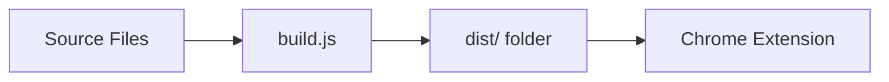

# Contributing to jaiid Extension

Thank you for your interest in contributing! This document provides guidelines for contributing to the jaiid (Just AI image descriptions) Chrome extension.

## Getting Started

### Prerequisites

- Node.js (v16 or higher)
- npm (v7 or higher)
- Chrome Canary or Chrome Dev
- Git

### Setup

1. **Fork the repository** on GitHub

2. **Clone your fork**:
   ```bash
   git clone https://github.com/YOUR-USERNAME/ai-alt-text.git
   cd ai-alt-text
   ```

3. **Install dependencies**:
   ```bash
   npm install
   ```

4. **Enable Chrome AI features**:
   - Open Chrome Canary/Dev
   - Navigate to `chrome://flags`
   - Enable "Prompt API for Gemini Nano"
   - Restart Chrome

5. **Load the extension**:
   - Open `chrome://extensions`
   - Enable Developer mode
   - Click "Load unpacked"
   - Select the project directory

## Development Workflow

### Making Changes

1. **Create a feature branch**:
   ```bash
   git checkout -b feature/your-feature-name
   ```

2. **Make your changes** to the source files

3. **Run tests** to ensure nothing breaks:
   ```bash
   npm test
   ```

4. **Test manually**:
   - Reload the extension in Chrome
   - Open `test-page.html` or a real webpage
   - Verify functionality works as expected

5. **Build the extension**:
   ```bash
   npm run build
   ```

6. **Commit your changes**:
   ```bash
   git add .
   git commit -m "feat: add your feature description"
   ```

### Commit Message Format

We follow the [Conventional Commits](https://www.conventionalcommits.org/) specification:

- `feat:` New feature
- `fix:` Bug fix
- `docs:` Documentation changes
- `style:` Code style changes (formatting, etc.)
- `refactor:` Code refactoring
- `test:` Adding or updating tests
- `chore:` Maintenance tasks

**Examples**:
```
feat: add copy to clipboard functionality
fix: correct image size detection for portrait images
docs: update README with new features
test: add tests for dynamic image loading
```

## Code Standards

### JavaScript Style Guide

- Use ES6+ features
- Use `const` and `let`, avoid `var`
- Use arrow functions where appropriate
- Add JSDoc comments for functions
- Keep functions small and focused (Single Responsibility)
- Use meaningful variable and function names

**Good Example**:
```javascript
/**
 * Check if an image meets the size and type requirements
 * @param {HTMLImageElement} img - The image element to check
 * @returns {boolean} - Whether the image is eligible
 */
function isEligibleImage(img) {
  const { naturalWidth, naturalHeight } = img;
  return naturalWidth >= 125 && 
         naturalWidth < 1500 && 
         naturalHeight >= 125;
}
```

### CSS Style Guide

- Use meaningful class names with `ai-alt-` prefix
- Keep specificity low
- Use CSS custom properties for theme values
- Comment complex selectors
- Group related properties

### Accessibility Requirements

**All UI changes MUST**:
- ✅ Include proper ARIA attributes
- ✅ Support keyboard navigation
- ✅ Work with screen readers
- ✅ Meet WCAG 2.2 Level AA standards
- ✅ Have sufficient color contrast (4.5:1 minimum)

## Testing

### Writing Tests

**All new features MUST include tests**:

1. **Unit tests** for new functions
2. **Integration tests** for user workflows
3. **Accessibility tests** for UI components

### Test Structure

```javascript
describe('Feature Name', () => {
  beforeEach(() => {
    // Setup
  });

  afterEach(() => {
    // Cleanup
  });

  test('should do something specific', () => {
    // Arrange
    const input = createTestInput();
    
    // Act
    const result = functionUnderTest(input);
    
    // Assert
    expect(result).toBe(expectedValue);
  });
});
```

### Running Tests

```bash
# Run all tests
npm test

# Run specific test file
npm test -- background.test.js

# Run with coverage
npm run test:coverage

# Watch mode
npm run test:watch
```

### Test Coverage Requirements

- **New code**: 80% coverage minimum
- **Bug fixes**: Add regression test
- **Refactoring**: Maintain existing coverage

## Build Process

### Understanding the Build

The build process copies only required files to `dist/`:



### Testing Your Build

```bash
# Build the extension
npm run build

# Load dist/ folder in Chrome
# Verify all features work
```

See [BUILD.md](BUILD.md) for detailed build documentation.

## Pull Request Process

### Before Submitting

- [ ] All tests pass (`npm test`)
- [ ] Code follows style guidelines
- [ ] Build succeeds (`npm run build`)
- [ ] Extension loads and works in Chrome
- [ ] Documentation is updated if needed
- [ ] Commit messages follow conventions

### Submitting a PR

1. **Push to your fork**:
   ```bash
   git push origin feature/your-feature-name
   ```

2. **Create Pull Request** on GitHub

3. **Fill in the PR template**:
   - Description of changes
   - Related issues
   - Testing performed
   - Screenshots (if UI changes)

4. **Wait for review**
   - Address feedback
   - Make requested changes
   - Push updates to the same branch

### PR Review Criteria

- ✅ Code quality and style
- ✅ Test coverage
- ✅ Accessibility compliance
- ✅ Documentation completeness
- ✅ No breaking changes (or justified)
- ✅ Build succeeds

## Types of Contributions

### Bug Fixes

1. **Check existing issues** to avoid duplicates
2. **Create an issue** describing the bug
3. **Write a failing test** that reproduces the bug
4. **Fix the bug** and make the test pass
5. **Submit PR** referencing the issue

### New Features

1. **Create an issue** to discuss the feature
2. **Wait for approval** before implementing
3. **Write tests** for the new feature
4. **Implement** the feature
5. **Update documentation**
6. **Submit PR**

### Documentation

- Fix typos, improve clarity
- Add examples or tutorials
- Update outdated information
- Translate to other languages

### Testing

- Increase test coverage
- Add edge case tests
- Improve test quality
- Add accessibility tests

## Project Structure

```
ai-alt-text/
├── manifest.json          # Extension config (don't break this!)
├── background.js          # Service worker
├── content.js             # Main content script
├── styles.css             # UI styling
├── build.js               # Build script
├── images/                # Extension assets
├── __tests__/             # Test files
├── README.md              # User documentation
├── TESTING.md             # Testing guide
├── BUILD.md               # Build guide
└── CONTRIBUTING.md        # This file
```

## Common Tasks

### Adding a New Feature

1. Update `content.js` or create new file
2. Add styles to `styles.css` if needed
3. Write tests in `__tests__/`
4. Update README.md with feature description
5. Test manually and with automated tests

### Modifying Image Detection Logic

1. Edit `isEligibleImage()` in `content.js`
2. Update tests in `__tests__/content.test.js`
3. Test with various image types and sizes
4. Update documentation if criteria changes

### Changing UI/Styling

1. Edit `styles.css`
2. Test accessibility (screen reader, keyboard)
3. Check color contrast (use Chrome DevTools)
4. Test on different screen sizes
5. Update screenshots in README if visible changes

### Improving AI Prompts

1. Edit `generateAltText()` in `content.js`
2. Test with various image types
3. Verify output quality
4. Consider edge cases (errors, timeouts)

## Getting Help

### Questions?

- Open a [GitHub Discussion](https://github.com/YOUR-ORG/ai-alt-text/discussions)
- Ask in the issues section
- Check existing documentation

### Found a Bug?

- Check [existing issues](https://github.com/YOUR-ORG/ai-alt-text/issues)
- Create a new issue with:
  - Clear description
  - Steps to reproduce
  - Expected vs actual behavior
  - Chrome version and OS
  - Screenshots if applicable

## Code of Conduct

### Our Standards

- Be respectful and inclusive
- Welcome newcomers
- Accept constructive criticism
- Focus on what's best for the community
- Show empathy towards others

### Unacceptable Behavior

- Harassment or discrimination
- Trolling or insulting comments
- Publishing others' private information
- Other unprofessional conduct

## Recognition

Contributors will be:
- Listed in release notes
- Credited in documentation
- Thanked publicly

## Resources

- [Chrome Extension Documentation](https://developer.chrome.com/docs/extensions/)
- [WCAG 2.2 Guidelines](https://www.w3.org/WAI/WCAG22/quickref/)
- [Jest Testing Framework](https://jestjs.io/docs/getting-started)
- [Conventional Commits](https://www.conventionalcommits.org/)
- [Semantic Versioning](https://semver.org/)

## License

By contributing, you agree that your contributions will be licensed under the MIT License.

---

**Thank you for contributing!** 🎉